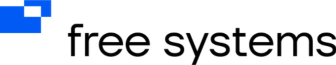

  

# FreeSystems AI Department

🚀 **Передовые решения в области искусственного интеллекта для открытого будущего**

---

### 🌟 О нас
Мы — инновационное подразделение **Free Systems**, сосредоточенное на разработке этичного, открытого и доступного ИИ.  
Наша миссия: создавать технологии, которые расширяют человеческие возможности и способствуют глобальному прогрессу.

---

## 🧠 Основные направления
- **Open-Source ML Frameworks**  
  Создаем инструменты с открытым исходным кодом для сообщества
- **NLP для низкоресурсных языков**  
  Демократизация языковых технологий
- **Интерпретируемый ИИ (XAI)**  
  Прозрачность и доверие к алгоритмам
- **Федеративное обучение**  
  Безопасный обмен знаниями без компромисса приватности

---

## 🚀 Наши проекты

### 🌐 
**Цель**:  
**Статус**:   
**Репозиторий**: 
**Особенности**:
- 
- 
- 

---

## 🤝 Присоединяйтесь к сообществу
Мы верим в силу открытой коллаборации! Как участвовать:
1. 🌱 **Новичок?** Начните с [Good First Issues](profile/contribute)
2. 💡 **Предложите идею** в [Discussions](profile/discussions)
3. 🐛 Сообщайте о багах через [Issues](profile/issues)
4. 📚 Улучшайте [документацию](profile/docs)

**Наши принципы**:  
✨ Открытость ✨ Инклюзивность ✨ Научная строгость

---

  <h3>📬 Контакты</h3>
  
Вопросы? Предложения? Приветствуем диалог!

  

    <a href="mailto:ai@free-systems.org">📧 Email</a> | 
    <a href="profile/forum">💬 Форум</a> | 
    <a href="profile/telegram">📢 Telegram-чат</a>
  

  Создано с ❤️ для будущего без технологических барьеров

